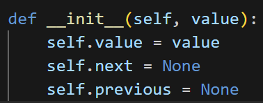

# Análisis de la Complejidad Computacional del Algoritmo

---

## Clase `Node`

La clase `Node` se encarga de inicializar un nodo de una **LDL** con sus ligas izquierda y derecha.

### Operaciones en el constructor (`__init__`):

| Instrucción            | Descripción                     | Complejidad |
|------------------------|---------------------------------|-------------|
| `self.value = value`   | Asigna el valor al nodo         | \( O(1) \)  |
| `self.next = None`  `self.previous = None`     | Inicializa las ligas izquierda y derecha | \( O(1) \)  |

Todas las operaciones (3) son **constantes**, independientes del tamaño de la lista.

$$
T_{\text{n}} = O(1) + O(1) + O(1) = 3 \cdot O(1) =  O(1)
$$

La complejidad general del consturctor es: $$O(1)$$

---

### Método `create_valid_node` (Clase `Node`)

###  Operaciones:

| Instrucción                                                                 | Descripción                                      | Complejidad |
|------------------------------------------------------------------------------|--------------------------------------------------|-------------|
| `isinstance(value, (int, float)) or isinstance(value, bool)`                | Validación de tipo de dato                             | \( O(1) \)  |
| `msg = f"...{type(value).__name__}...{value!r}..."`                         | Construcción del mensaje de error (solo si falla) | \( O(1) \)  |
| `return None, msg`                                                          | Retorno rápido del mensaje si no es valido                   | \( O(1) \)  |
| `return cls(value), None`                                                   | Creación del nodo si el valor es válido          | \( O(1) \)  |

Todas las operaciones son **constantes, la validación del tipo de dato se realiza de manera única para cada nodo, además que es `independiente del tamaño de la lista`. Notemos que no influye el tamaño del valor almacenado en `value`

$$
T_{\text{n}} = O(1) + O(1) + O(1) + O(1) = 4 \cdot O(1)
$$

La complejidad general es: $$O(1)$$

---

##  Clase `DoublyLinkedList`

Encargada de crear la **LDL**, agregar elementos, imprimir y hacer el proceso del calculo de la moda.

---

###  Método `__init__` (Clase `DoublyLinkedList`)

###  Operaciones:

| Instrucción          | Descripción                             | Complejidad |
|----------------------|-----------------------------------------|-------------|
| `self.head = None`   | Inicializa la referencia al primer nodo | \( O(1) \)  |
| `self.last = None`   | Inicializa la referencia al último nodo | \( O(1) \)  |
| `self.size = 0`      | Inicializa el contador de tamaño        | \( O(1) \)  |

Notemos que el constructor de la clase es extremadamente similar al `__init__` de la clase `Node`. Realiza 3 asignaciones simples cada una de costo $$O(1)$$

Similarmente su costo será: 

$$T_{\text{n}} =  3 \cdot O(1)$$
---

---

###  Método `insert_node_at_end`

Inserta un nodo válido al final de la lista.

| Paso                                   | Instrucción                         | Complejidad |
|----------------------------------------|-------------------------------------|-------------|
| Verificar si la lista está vacía       | `self.list_null()`                  | \( O(1) \)  |
| Insertar en lista vacía                | `self.head = self.last = new_node` | \( O(1) \)  |
| Enlazar nuevo nodo con anterior        | `self.last.next = new_node`        | \( O(1) \)  |
| Enlazar anterior con nuevo nodo        | `new_node.previous = self.last`    | \( O(1) \)  |
| Actualizar la cola                     | `self.last = new_node`             | \( O(1) \)  |
| Incrementar tamaño                     | `self.size += 1`                   | \( O(1) \)  |

Todas las operaciones se realizan 1 sola vez para cada Nodo, notememos que el método recibe un nodo ya valido, por lo que solo hace una reasignación en la linea `new_node = valid_node`, de aquí en adelante realiza 4 operaciones simples para enlazar este nodo con los circurdantes a traves de sus ligas `(todas operaciones básicas:  O(1))`, finalmente incrementa el tamaño de la `LDL`.

**Complejidad total.**

$$
T_{\text{n}} = 5 \cdot O(1) 
$$

La complejidad general del método es: $$O(1)$$

---

###  Método `print_ldl` (Clase `DoublyLinkedList`)

Este método recorre toda la lista doblemente ligada desde la cabecera (`head`) hasta el final, imprimiendo la posción del nodo en la LDL y el valor de cada nodo.

###  Operaciones:

| Instrucción                                      | Descripción                                 | Frecuencia           | Complejidad |
|--------------------------------------------------|---------------------------------------------|-----------------------|-------------|
| `self.list_null()`                               | Verifica si la lista está vacía             | 1 vez                 | \( O(1) \)  |
| `current = self.head`                            | Inicializa el puntero al primer nodo        | 1 vez                 | \( O(1) \)  |
| `contador = 1`                                   | Inicializa el contador de posición          | 1 vez                 | \( O(1) \)  |
| `while current:`                                 | Recorrido de todos los nodos                | hasta \( n \) veces   | —           |
| `print(f"Nodo {contador}: {current.value}")`     | Imprime valor del nodo                      | \( n \) veces         | \( O(1) \)  |
| `current = current.next`                         | Avanza al siguiente nodo                    | \( n \) veces         | \( O(1) \)  |
| `contador += 1`                                  | Incrementa el contador                      | \( n \) veces         | \( O(1) \)  |

Explicación de operaciones. 

**Paso 1: Operaciones iniciales**
Estas tres instrucciones se ejecutan una sola vez:

$$
O(1) + O(1) + O(1) = 3 \cdot O(1)
$$

---

**Paso 2: Operaciones dentro del bucle**

El bucle `while current:` se ejecuta \( n \) veces (una vez por nodo).  
En cada iteración hay 3 operaciones constantes:

$$
n \cdot (O(1) + O(1) + O(1)) = n \cdot 3 \cdot O(1)
$$

---

**Paso 3: Sumar todas las operaciones**

Se suman los costos fuera y dentro del bucle:

$$
T_{\text{printLdl}} = 3 \cdot O(1) + n \cdot 3 \cdot O(1)
$$

---

**Paso 4: tomar la complejidad general descartando constantes**

Factorizamos:

$$
= O(1) + O(n)
$$

---

**Complejidad total.**

El término \( O(n) \) es el de mayor relavancia , \( O(1) \) es despreciable, por lo tanto:

$$
\boxed{T_{\text{printLdl}} = O(n)}
$$

---

## Método `contar_frecuencias`

Este es el núcleo del análisis estadístico. Cuenta cuántas veces aparece cada valor en la lista original, usando otra lista ligada como tabla de frecuencias.

###  Análisis paso a paso

| Paso | Instrucción                                      | Descripción                                                                 | Frecuencia esperada | Complejidad |
|------|--------------------------------------------------|-----------------------------------------------------------------------------|----------------------|-------------|
| 1    | `lista_frec = DoublyLinkedList()`                | Crea una `LDL` para acumular las frecuencias                         | 1 vez                | \( O(1) \)  |
| 2    | `current = self.head`                            | Inicializa el puntero de recorrido de la lista original  partiendo desde la cabecera                  | 1 vez                | \( O(1) \)  |
| 3    | `while current:`                                 | Recorre cada nodo original                                                  | hasta \( n \) veces  | —           |
| 3.1  | `f = lista_frec.head`                            | Reinicia puntero de búsqueda en cada iteración                             | hasta \( n \) veces  | \( O(1) \)  |
| 3.2  | `while f:`                                       | Recorre la lista de frecuencias por cada nodo                              | hasta \( n \) veces  | \( O(n) \) en el peor caso |
| 3.3  | `if f.value[0] == current.value:`                | Compara el valor con cada frecuencia existente                             | —                    | \( O(1) \)  |
| 3.4  | `f.value = (f.value[0], f.value[1] + 1)`         | Actualiza la frecuencia si ya existe                                       | —                    | \( O(1) \)  |
| 3.5  | `nuevo = Node((current.value, 1))`               | Crea un nuevo nodo si el valor no estaba presente                          | —                    | \( O(1) \)  |
| 3.6  | `lista_frec.insert_node_at_end(nuevo)`           | Inserta al final de la lista de frecuencias                                | —                    | \( O(1) \)  |
| 4    | `current = current.next`                         | Avanza en la lista original                                                | hasta \( n \) veces  | \( O(1) \)  |
| 5    | `return lista_frec`                              | Retorna la lista generada                                                  | 1 vez                | \( O(1) \)  |

---

###  Construcción polinomio

#### Paso 1: Inicializaciones

Se ejecutan una sola vez:

$$
T_{\text{init}} = O(1) + O(1) = 2 \cdot O(1)
$$

---

#### Paso 2: Bucle externo (hasta \( n \))

Cada nodo en la lista original (de tamaño \( n \)) puede generar una búsqueda completa dentro de la lista de frecuencias.

$$
\sum_{i=1}^{n-1} i = \frac{n(n-1)}{2} \in O(n^2)
$$

---

#### Paso 3: Insertar nuevo nodo (si no se encuentra)

La operación `insert_node_at_end()` es constante, pero solo se ejecuta una vez por nodo como máximo.

$$
n \cdot O(1)
$$

---

### Suma total

$$
T(n) = O(1) + O(n^2) + O(n) + O(1) \Rightarrow \boxed{T(n) = O(n^2)}
$$

El término cuadrático domina el comportamiento, ya que en el peor caso se hacen comparaciones acumulativas para cada nuevo nodo.

##  Método `contar_frecuencias` desglose

Este método recorre la lista original y genera otra lista (`lista_frec`) con la frecuencia de cada valor.

---

**Paso 1: Recorrer todos los nodos de la lista original**

Se ejecuta una vez por cada nodo (Que será el `current`):

$$
n \cdot (\text{operacion bucle interno })
$$

Podemos ver que sucede en: 

---

**Paso 2: Para cada nodo, buscar si ya existe en `lista_frec` (ciclo interno) / insertarlo**

En el peor caso, se compara contra todos los elementos existentes en la lista de frecuencias:

$$
\sum_{i=1}^{n-1} i = \frac{n(n-1)}{2} \in O(n^2)
$$

**¿Por qué llegamos a esta suma?**
Veamos el comportamiento de la serie:

- En la primera iteración tenemos que: `lista_frec` está vacia : No hay comparaciones

- En la segunda iteración ya se agrego un `nodo` por lo tanto comparamos `current` con un solo nodo. = `1 comparacion`

- En la tercera iteración `puede haber un solo nodo` por lo tanto comparamos `current` con un solo nodo. = `1 comparacion` 

 

ó si el nodo de la comparación anterior no se repite, entonces se agregó a la lista de frecuencias aquí.

En este caso ya tenemos `2 nodos` por lo tanto comparamos `current` con un dos nodos. = `2 comparaciones` 

Similarmente en la siguiente iteración, quizas aún no han habido repeticiones y ya tenemos `3 nodos` y  `3 comparaciones`.

**¿Que significa esto?**

Que en el peor de los casos `(No hay repeticiones de nodos)` para la cantidad de comparaciones tenemos :

$$ 1+2+3+⋯+(n−1)$$

Lo que equivale a:

$$
\sum_{i=1}^{n-1} i = \frac{n(n-1)}{2} \in O(n^2)
$$

En el análisis esto es una operación de orden cuadratico, y por eso pertenecer a dicha notación. 

**Paso 4: Resultado final**

Tenemos varios términos: **\( O(1) \)**, y  **O(n)**, pero ya sabemos que existe (en el peor de los casos) un término dominante: $$\boxed{O(n^2)}$$

Por lo tanto despreciando constantes y complejidades de menor orden podemos concluir que:

$$
\boxed{T_{\text{contarFrecuencias}} = O(n^2)}
$$

---

### Método `frecuencia_maxima`

###  Método `frecuencia_maxima`

Recorre la lista de frecuencias y retorna el valor de la frecuencia más alta encontrada.

---

| Paso | Instrucción                          | Descripción                                   | Complejidad |
|------|--------------------------------------|-----------------------------------------------|-------------|
| 1    | `max_freq = 1`                       | Inicialización de variable                    | \( O(1) \)  |
| 2    | `current = lista_frec.head`          | Inicialización de puntero                     | \( O(1) \)  |
| 3    | `while current:`                     | Recorre cada nodo una vez                     |  \( O(n) \)  |
| 3.1  | `if current.value[1] > max_freq:`    | Comparación en cada iteración                 | \( O(1) \)  |
| 3.2  | `max_freq = current.value[1]`        | Asignación si es necesario                    | \( O(1) \)  |
| 4    | `current = current.next`             | Avanza al siguiente nodo                      | \( O(1) \)  |
| 5    | `return max_freq`                    | Devuelve el valor máximo encontrado           | \( O(1) \)  |

---

### Composición polinomio

#### Parte 1: Inicializaciones

Se ejecutan 2 instrucciones **una sola vez**:

$$
T_{\text{init}} = O(1) + O(1) = 2 \cdot O(1)
$$

#### Parte 2: Iteraciones sobre la lista

Por cada uno de los \( n \) nodos de `lista_frec`, se realizan **3 operaciones constantes** (comparación, posible asignación, avance del puntero):

$$
T_{\text{bucle}} = n \cdot (O(1) + O(1) + O(1)) = n \cdot 3 \cdot O(1)
$$

#### Parte 3: Retorno

Una única operación al final:

$$
T_{\text{return}} = O(1)
$$

---

### Suma total de operaciones

$$
T(n) = 2 \cdot O(1) + 3n \cdot O(1) + O(1) = O(1) + O(n) + O(1)
$$

$$
\Rightarrow \boxed{T_{\text{frecuenciaMaxima}}(n) = O(n)}
$$

El término dominante es lineal, por lo tanto, la complejidad de este método es: **$$ \boxed{O(n)} $$**

Analogamente a métodos anteriores, tenemos operaciones de magnitud constante O(1) al principio, seguidas operaciones de magnitud (O(1)) detro de un bucle aninado, que se repiten para cada nodo. Podemos a este punto concluir que la frecuencia predominante es O(n).

$$T_{\text{frecuenciaMaxima}}(n) = O(n)$$
---

### Método `contar_modas`

Cuenta cuántos valores tienen la frecuencia máxima.

| Paso | Instrucción                          | Descripción                                       | Complejidad |
|------|--------------------------------------|---------------------------------------------------|-------------|
| 1    | `f = lista_frec.head`                | Inicialización de puntero                         | \( O(1) \)  |
| 2    | `count = 0`, `moda = None`           | Inicialización de variables                       | \( O(1) \)  |
| 3    | `while f:`                           | Recorre toda la lista de frecuencias              | \( O(n) \)  |
| 3.1  | `if f.value[1] == max_freq:`         | Comparación simple                          | \( O(1) \)  |
| 3.2  | `count += 1`                         | Incremento de contador                            | \( O(1) \)  |
| 3.3  | `moda = f.value[0]`                  | Asignación de la moda                | \( O(1) \)  |
| 4    | `f = f.next`                         | Avanza al siguiente nodo                          | \( O(1) \)  |
| —    | `return count, moda`                 | Retorna la cantidad y una moda encontrada         | \( O(1) \)  |

### Composición polinomio

#### Paso 1: Inicializaciones

Estas instrucciones se ejecutan una única vez:

$$
T_{\text{init}} = O(1) + O(1) + O(1) = 3 \cdot O(1)
$$

#### Paso 2: Iteraciones

En cada iteración (hasta \( n \) veces), se ejecutan:

- Una comparación,
- Posible incremento,
- Posible reasignación,
- Avance del puntero

Es decir, 4 operaciones constantes:

$$
T_{\text{bucle}} = n \cdot (O(1) + O(1) + O(1) + O(1)) = n \cdot 4 \cdot O(1)
$$

#### Paso 3: Retorno

Se ejecuta una vez al final:

$$
T_{\text{return}} = O(1)
$$

---

### Suma total de operaciones

$$
T(n) = 3 \cdot O(1) + 4n \cdot O(1) + O(1)
$$

$$
\Rightarrow \boxed{T_{\text{contarModas}}(n) = O(n)}
$$

Este método es de **complejidad lineal**, ya que recorre la lista una sola vez con operaciones constantes en cada paso.

$$
T_{\text{contarModas}}(n) = O(n)
$$

---

## Método `get_mode` (Orquestador general)

Este método orquesta todo el cálculo de la moda, invocando todos los anteriores (**Tomaremos en cuenta los métodos más relevantes**, recordemos que los métodos constructores, o que no recorren ningun ciclo de magnitud O(1),  como: `insert_node_at_end` o los constructores `__init__`),  serán despreciables al calculo final (Auqneu sabemos que todos los métodos se usan en la ejecución no son tan relevantes para el análisis final)

Este método orquesta el cálculo de la moda llamando a:

- `contar_frecuencias()` → \( O(n^2) \)
- `frecuencia_maxima()` → \( O(n) \)
- `contar_modas()` → \( O(n) \)

---

**Paso 1: Invocación de métodos**

$$
O(n^2) + O(n) + O(n)
$$

---

**Paso 2: Agrupación y simplificación**

El término cuadrático domina:

$$
\boxed{T_{\text{getMode}} = O(n^2)}
$$

---

## Polinomio Global del Programa

Incluyendo la construcción de la lista original (con inserciones \( O(n) \)), podemos definir un polinomio aproximado basado en la complejidad hallada para los métodos.

**Paso 1: Inserciones de nodos**

$$ n \cdot O(1) = b_1 \cdot n$$

---

**Paso 2: Lógica de moda (domina el tiempo total)**

$$a \cdot n^2 + b_2 \cdot n$$

---

**Paso 3: Operaciones constantes**

$$c$$

---

**Resultado final:**

$$
T(n) = a n^2 + b n + c
$$

Donde:

- \( a \): proviene de `contar_frecuencias` (comparaciones anidadas).
- \( b \): suma de recorridos simples e inserciones.
- \( c \): inicializaciones y validaciones constantes.

---

Podemos asociar las siguientes constantes según los métodos: 

### Clasificación de operaciones según coeficiente del polinomio 
$$
T(n) = a n^2 + b n + c
$$

| Coeficiente | Tipo de operación                                                        | Ejemplos del código                                     | Método(s) donde aparece                   |
|-------------|---------------------------------------------------------------------------|----------------------------------------------------------|-------------------------------------------|
| \( a \) (cuadrático) | Comparaciones acumuladas o bucles anidados dependientes de **n** :       | `if f.value[0] == current.value` dentro de `while f:`    | `contar_frecuencias()`                    |
|             | Inserciones que dependen de búsquedas lineales previas :                   | `insert_node_at_end(nuevo)` después de buscar en `lista_frec` | `contar_frecuencias()`                    |
| \( b \) (lineal)     | Recorridos simples por la lista (una vez por nodo)                      | `while current:`                                         | `frecuencia_maxima()`                     |
|             | Conteo de coincidencias con `if` dentro de un recorrido                  | `if f.value[1] == max_freq:`                             | `contar_modas()`                          |
|             | Inserciones en la lista original                                         | `ldl.insert_node_at_end(nodo)`                          | código de construcción inicial            |
| \( c \) (constante)  | Inicializaciones y asignaciones fuera de bucles                  | `max_freq = 1`, `count = 0`, `moda = None`               | `frecuencia_maxima()`, `contar_modas()`   |
|             | Validaciones simples sin recorrer estructuras                           | `if self.list_null()`                                    | `get_mode()`                              |
|             | `return` de funciones sin logica adicional                              | `return max_freq`, `return count, moda`                  | varios métodos                            |

---
