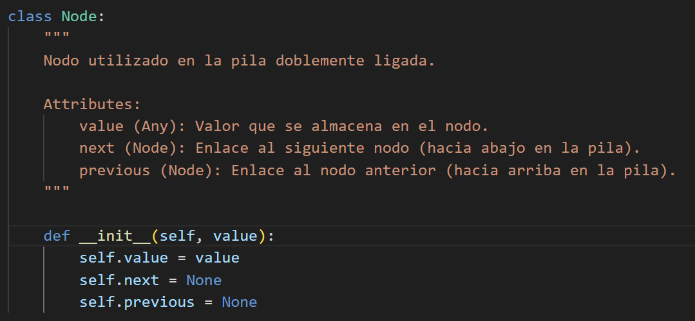
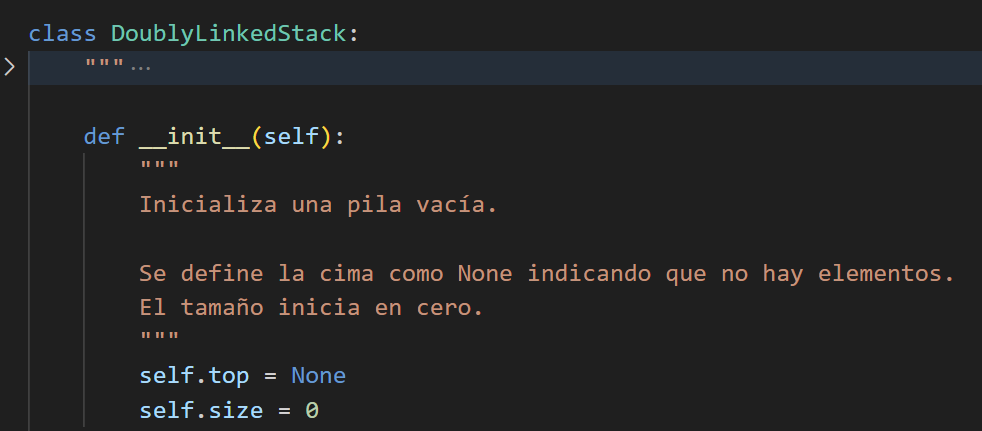
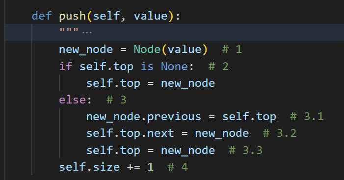
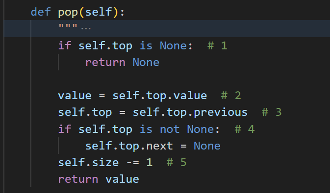
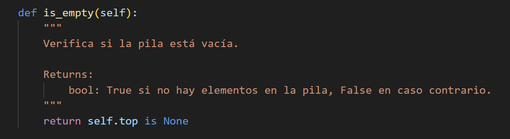
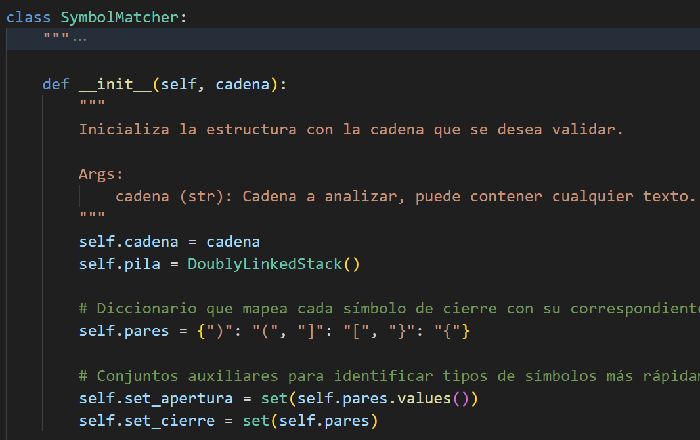
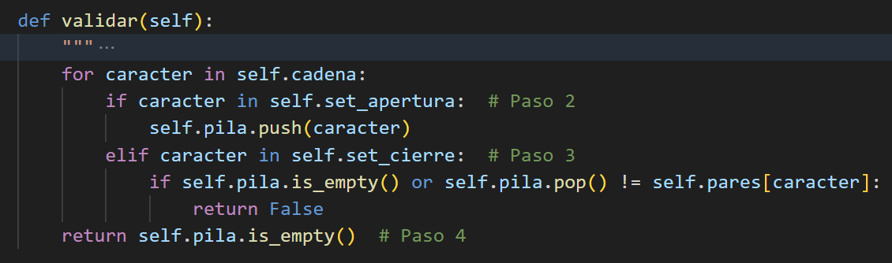

#  Análisis de la Complejidad Computacional del Algoritmo `SymbolMatcher`

---

## Clase `Node`

###  Complejidad del Constructor `__init__`

| Instrucción             | Descripción                              | Complejidad |
|------------------------|------------------------------------------|-------------|
| `self.value = value`   | Asigna el valor                          | \( O(1) \)  |
| `self.next = None`     | Inicializa el siguiente nodo como `None` | \( O(1) \)  |
| `self.previous = None` | Inicializa el anterior como `None`       | \( O(1) \)  |

### Resultado

$$
T_{\text{Node}} = 3 \cdot O(1) = O(1)
$$

---

## Clase `DoublyLinkedStack`

Implementa una estructura tipo pila (LIFO) con nodos doblemente ligados.

###  Constructor `__init__`

| Instrucción        | Descripción                    | Complejidad |
|--------------------|--------------------------------|-------------|
| `self.top = None`  | Inicializa la cima vacía       | \( O(1) \)  |
| `self.size = 0`    | Inicializa el tamaño en cero   | \( O(1) \)  |

**Resultado**:

$$
T_{\text{init\_stack}} = 2 \cdot O(1) = O(1)
$$

---

###  Método `push()`

Apila un nuevo valor en la cima de la pila.

| Operación                       | Descripción                                  | Complejidad |
|--------------------------------|----------------------------------------------|-------------|
| Crear nodo                     | `new_node = Node(value)`                     | \( O(1) \)  |
| Verificar si pila está vacía   | `if self.top is None:`                       | \( O(1) \)  |
| Actualizar referencias         | `previous`, `next`, `top = new_node`         | \( O(1) \)  |
| Incrementar tamaño             | `self.size += 1`                             | \( O(1) \)  |

Todas las operaciones (4) son de complejidad (O(1)) luego, 

$$
T_{\text{n}} = O(1) + O(1) + O(1) + O(1) = 4 \cdot O(1) =  O(1)
$$

**Resultado**:

$$
T_{\text{push}} = O(1)
$$

---

###  Método `pop()`

Elimina y retorna el último elemento de la pila.

| Operación                    | Descripción                                 | Complejidad |
|-----------------------------|---------------------------------------------|-------------|
| Verificar si está vacía     | `if self.top is None:`                      | \( O(1) \)  |
| Guardar valor actual        | `value = self.top.value`                    | \( O(1) \)  |
| Actualizar cima             | `self.top = self.top.previous`             | \( O(1) \)  |
| Desvincular nodo superior   | `self.top.next = None`                      | \( O(1) \)  |
| Disminuir tamaño            | `self.size -= 1`                            | \( O(1) \)  |

Todas las operaciones (5) son de complejidad (O(1)) luego, 

$$
T_{\text{n}} = O(1) + O(1) + O(1) + O(1) +O(1) = 5 \cdot O(1) =  O(1)
$$

**Resultado:**

$$
T_{\text{pop}} = O(1)
$$

---

###  Método `is_empty()`

Verifica si la pila está vacía. Solo hace una comparación:

$$
T_{\text{is\_empty}} = O(1)
$$

---

## Clase `SymbolMatcher`

Contiene la lógica de validación de emparejamiento de símbolos: (), [], {}.

###  Constructor `__init__`

| Instrucción         | Descripción                                     | Complejidad |
|---------------------|--------------------------------------------------|-------------|
| `self.cadena = ...` | Guarda la cadena original                        | \( O(1) \)  |
| `self.pila = ...`   | Instancia una pila vacía                         | \( O(1) \)  |
| Crear `dict`        | Asigna mapeo de cierre/apertura                  | \( O(1) \)  |
| Crear `set`s        | Define los sets para guardar simbolos de apertura y cierre             | \( O(1) \)  |

Similarmente a los métodos anteriores, de inmediato concluimos: 

**Resultado:**

$$
T_{\text{init\_matcher}} = O(1)
$$

---

###  Método `validar()`

Recorre la cadena caracter a caracter y gestiona una pila de símbolos:

###  Tabla de Complejidad del método `validar`

| Fase                    | Operación                                                   | Frecuencia     | Complejidad |
|------------------------|-------------------------------------------------------------|----------------|-------------|
| Iterar por caracteres  | `for caracter in self.cadena:`                              | hasta \( n \)  | \( O(n) \)  |
| Evaluar condición      | `caracter in self.set_apertura` / `in self.set_cierre`      | hasta \( n \)  | \( O(1) \)  |
| Apilar carácter        | `self.pila.push(caracter)`                                  | hasta \( n \)  | \( O(1) \)  |
| Verificar vacía / pop  | `is_empty()` y `pop()`                                       | hasta \( n \)  | \( O(1) \)  |
| Validación final       | `self.pila.is_empty()`                                      | 1 vez          | \( O(1) \)  |

---

###  Suma Total de Operaciones

$$
T(n) = n \cdot (O(1) + O(1) + O(1)) + O(1) = O(n) + O(1)
$$

$$
\boxed{T(n) = O(n)}
$$

#### Resultado final:

Cada operación sobre la pila es \( O(1) \), pero el ciclo recorre todos los caracteres de la cadena una vez. Por tanto:

$$
T_{\text{validar}} = O(n)
$$

---

##  Polinomio Global del Programa

Considerando los pasos:

1. Creación de estructuras e inicialización: $$ c \cdot O(1) $$  
2. Procesamiento de la cadena símbolo a símbolo: $$ b \cdot n \cdot O(1) $$

---

### Resultado final:

$$
T(n) = b \cdot n + c \in O(n)
$$

Donde:

- \( b \): Operaciones sobre pila por cada símbolo  
- \( c \): Inicializaciones y validaciones simples  
